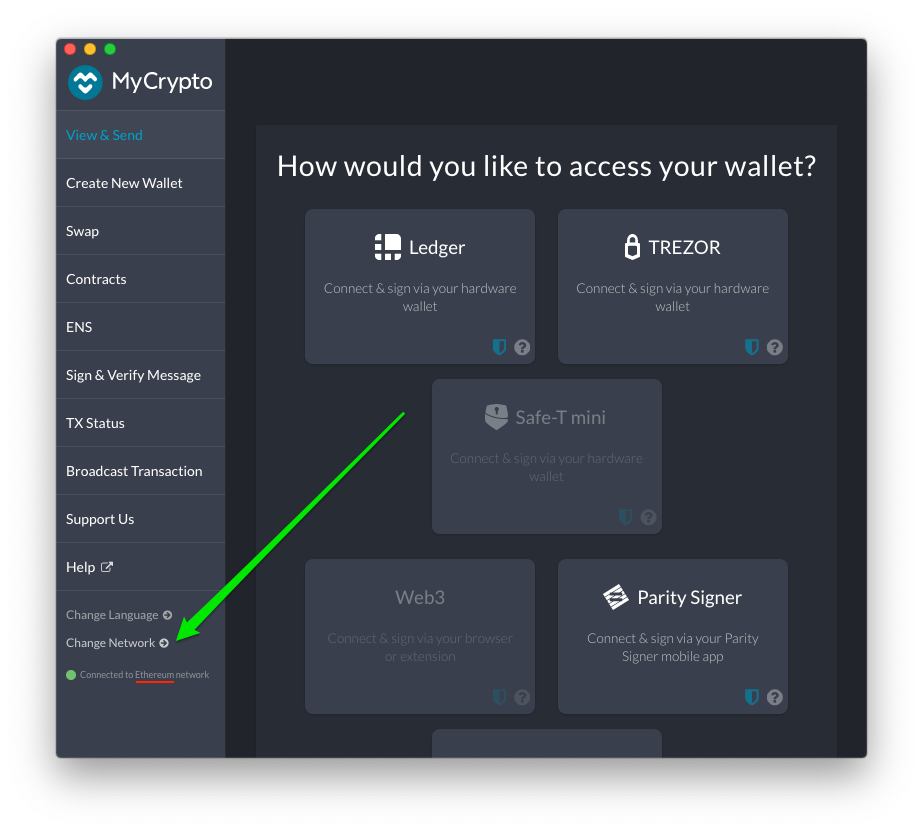
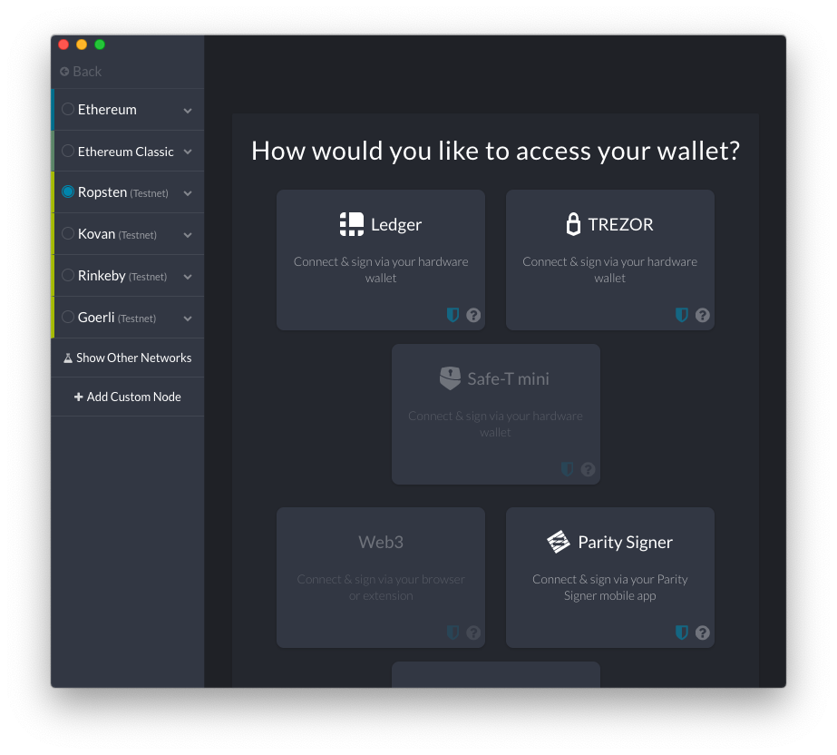
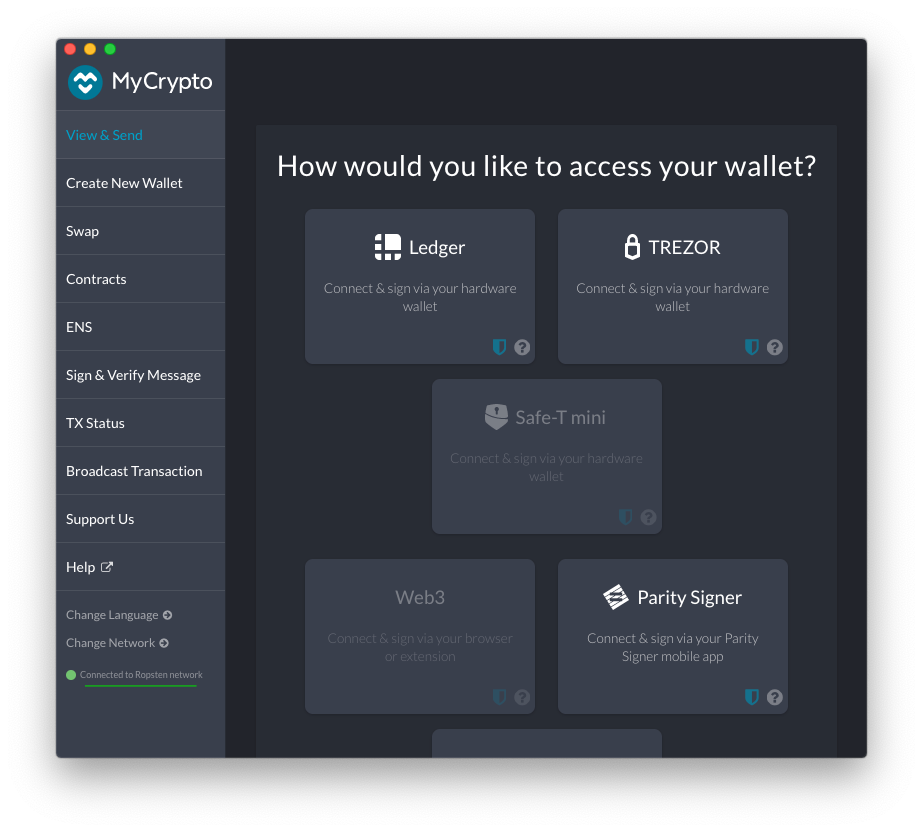

## Choosing the Ethereum Network
In this example we will be enrolling on the Ropsten network. To verify you are on Ropsten follow these steps:

1. Open MyCrypto and select the desired network.
 
Ropsten in the example below: 

2. Verify the active network is the desired network. If not, click *Change Network*

3. Choose your target network. In this example, we will setup a Validator account on Ropsten testnet.

4. Verify the selected network is Ropsten.