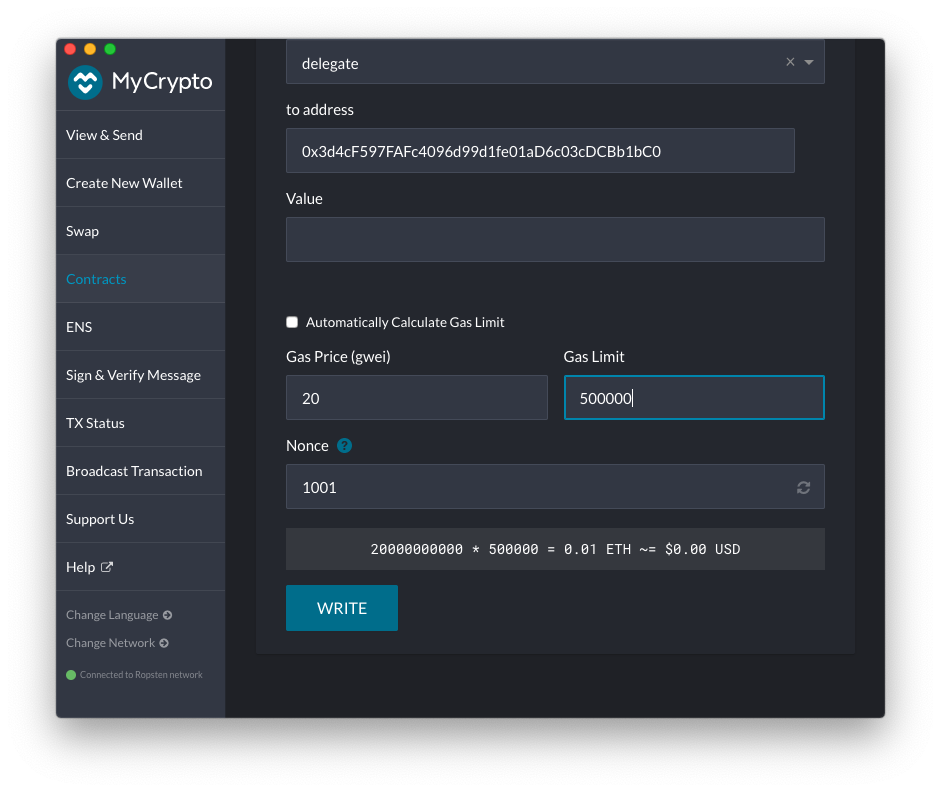
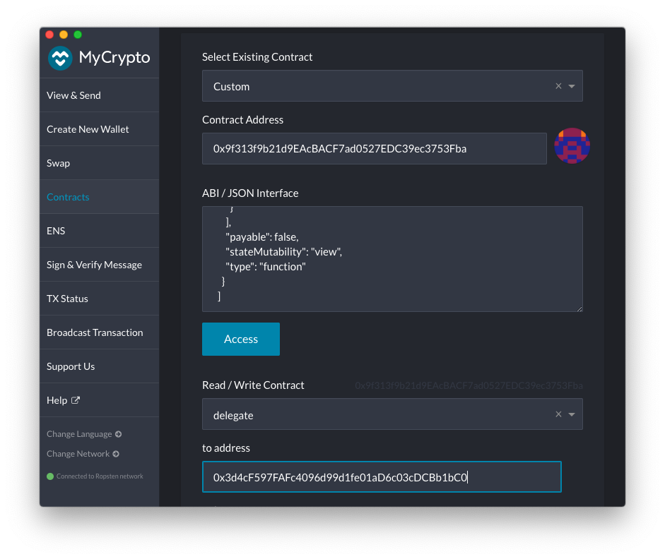
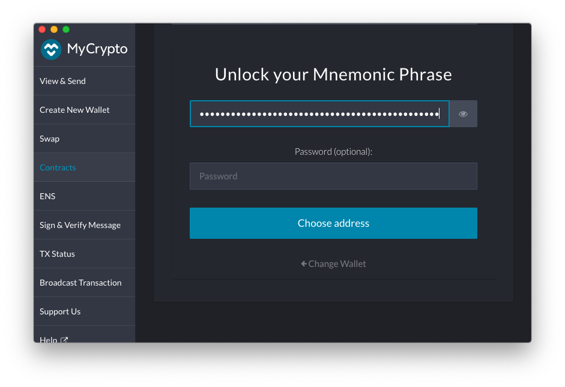
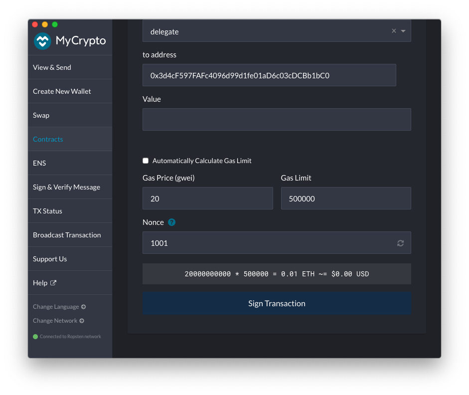
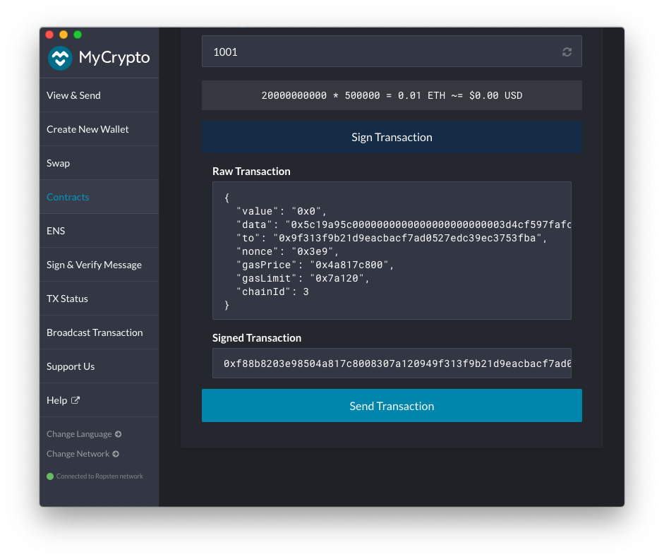
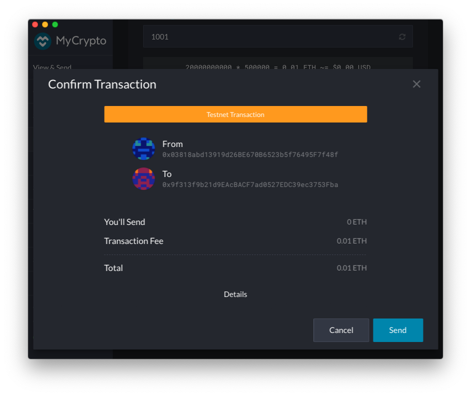
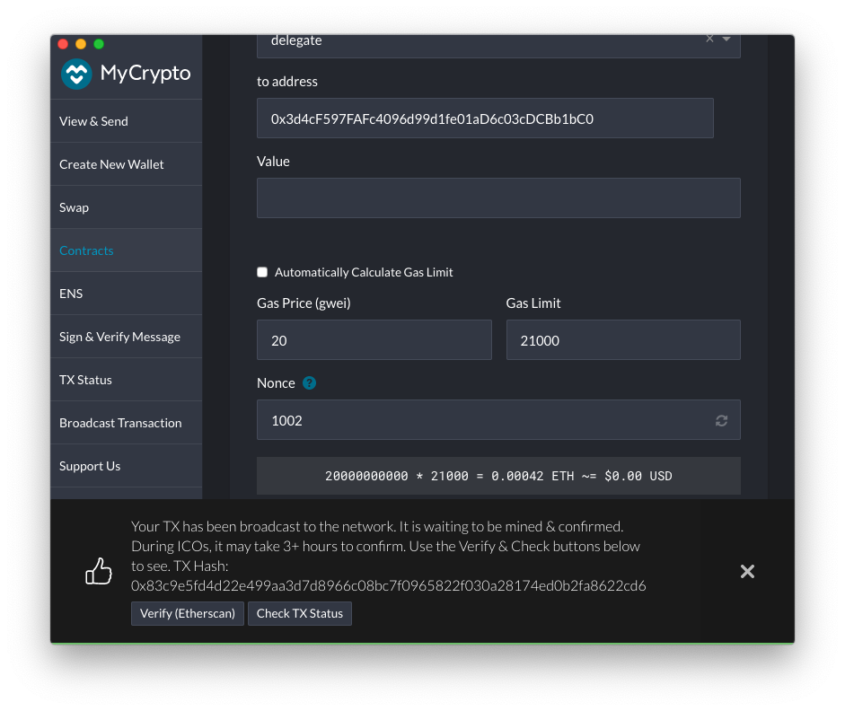
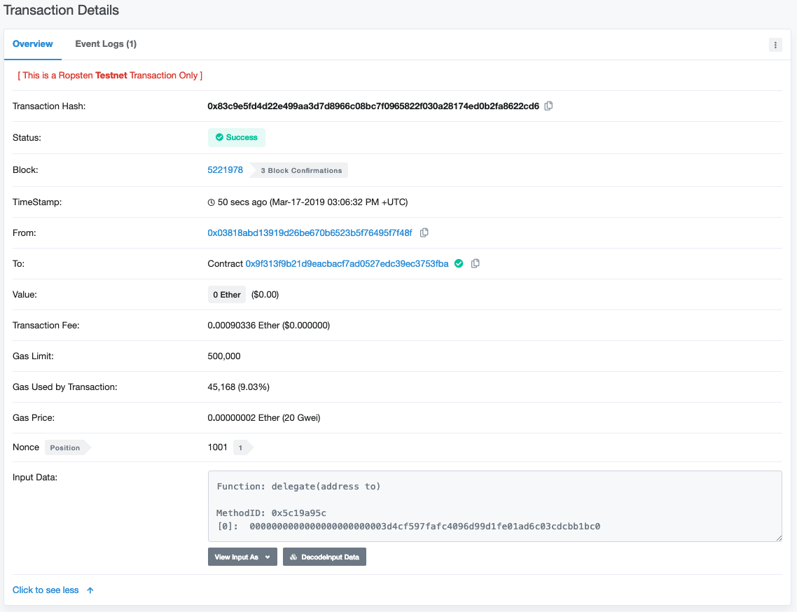

## Explicit/Implicit Delegation

Orbs token holders are encouraged to particiapte in the Orbs Universe by delegating their voting weight (stake) to another a guardian that they trust. By delegating to an active and reputable guardian a delegator contributes the network security and becomes eligible for rewards. A delegator may choose to delegate to another Delegator trusting her with the selection of the Guardian. (see detailed explanation [here][voting_explained]).  

Delegation is performed by one of two mechanisms: 
* An *implicit delegation* is performed by a transfer of 7 token fractions 
* An *explicit delegation* is performed by a Delegation transaction sent to OrbsVoting contract. 

Once delegated, a delegation remains valid and persists unless modified. A delegation may be modified at any time, or canceled by delegating to the Delegator's address. Once explicit delegation was preformed, it take precedence over an implicit delegation, even if it occurs later than the explicit one.   

The voting weight of each Delegator and the stake used fot the reward calculation is based on the Delegator stake at the time of each election event.

For a more detailed account of delegation (including implicit delegation), voting, and rewards see [here][voting_explained]

This document describes the *Explicit delegations* using OrbsVoting contract.

The document walks you through the voting process using the MyCrypto desktop wallet application.
Any wallet software may be used, and the choice of MyCrypto here is for illustration only.

[voting_explained]: http://broken

### Delegation requires following data:
- Ethereum Address of another delegator or a *guardian* to delegate to

### Delegation pre-requirements
 - MyCrypto desktop app (or another equivalent wallet software)
 - A wallet setup with your Delegator's Ethereum account keys with a positive Ether balance for gas payment
 - ABI and contract address available on Etherscan. For example, on Ropsten testnet the contract may be found [here][1] 

### Delegation steps

In order to delegate follow these steps:

1. **Verify you are on the correct network** ([Choosing the relevant Ethereum Network](./choosing_the_network.md))
2. Navigate to *Contracts*, under the *Interact* tab.

1. Enter the `OrbsVoting` contract address. For Ropsten testnet the address may be found [here][1]. Paste the address in the text box labeled *Contract Address*.
1. Extract the Contract ABI from the Etherscan *code* [tab][1] and paste it in the test box labeled *ABI / JSON Interface*. 

1. Click *Access*.
   * If the *Access* button appears disabled, make sure there are no trailing line feeds at the bottom of the *ABI / JSON Interface* text box.
1. Select `delegate` in the drop down list *Read / Write Contract*

The function parameter for the `delegate` call will appear in the form.
1. Fill the parameter field labeled `to address`
with the Ethereum account address you would like to delegate to.
    - for example: `0x3d4cF597FAFc4096d99d1fe01aD6c03cDCBb1bC0`
    - only valid addresses are accepted. To cancel a previous delegation, delegate to the sender's address

1. Choose one of the options under *How would you like to access your wallet?*
and provide your wallet information/credentials.
In this example we choose to provide a mnemonic to open our wallet:

Click *Choose Address*

1. Select your Delegator's Ethereum address. 
The address you choose should be the address holding the Orbs token balance you wish to delegate.
Make sure the account has a positive Ether balance for transaction fees. 
 
Then click *Unlock* 

1. Uncheck *Automatically Calculate Gas Limit* and adjust the *Gas Limit* as required. 
`500,000` should be more than enough (at the time this is being written a successful delegation uses 
~64,352 Gas). You will not be charged for unused gas.
 
Click *WRITE*

Don't forget to adjust Gas Price so the transaction is accepted in a reasonable time. Then Click *Write*, and then *Sign Transaction* 

Click *Send Transaction*

Review, then click *Send*

1. Once the transaction is sent, MyCrypto will provide a link to track the transaction status on Etherscan.
Navigate to *Etherscan* by clicking *Verify (Etherscan)*

1. Confirm the transaction has been accepted successfully.

 
Make sure you see 
> TxReceipt Status:Success

With sufficient block confirmations.

[1]: https://ropsten.etherscan.io/address/0x9f313f9b21d9EAcBACF7ad0527EDC39ec3753Fba#code
