## Guardian Registration
In order to participate in the voting, a Guardian must first register. 
An Orbs Guardian is identified and delegated to by her Ethereum address. 

This document walks you through the registration process of Guardians using the MyCrypto desktop wallet application.
Any wallet software may be used, and the choice of MyCrypto here is for illustration only.

### A Guardian registration requires to following data:
- Name and website URL of the Guardian

Note: A Guardian may update her registration data at any time or leave the registry.

### Registration pre-requirements
 - MyCrypto desktop app (or another equivalent wallet software)
 - A wallet setup with your Guardian's Ethereum account keys with a positive Ether balance for fees
 - ABI and contract address available on Etherscan. For example, on Ropsten testnet the contract may be found [here][1] 
 - 1 Ether deposit required to resgister as a Guardian
 - Registration data

### Registration steps

1. **Verify you are on the correct network** ([Choosing the relevant Ethereum Network](./choosing_the_network.md))
2. Navigate to *Contracts*, under the *Interact* tab.
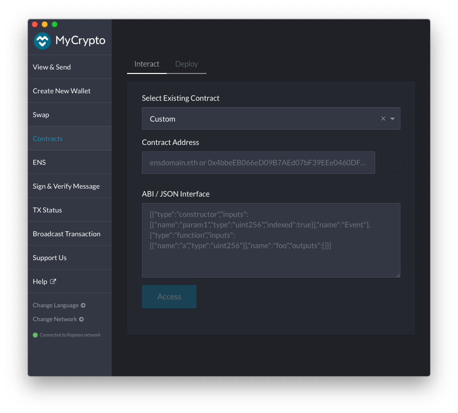
1. Enter the `OrbsGuardians` contract address. For Ropsten testnet the address may be found [here][1]. Paste the address in the text 
box labeled *Contract Address*.
1. Extract the contract ABI from the Etherscan *code* tab and paste it 
in the test box labeled *ABI / JSON Interface*. 
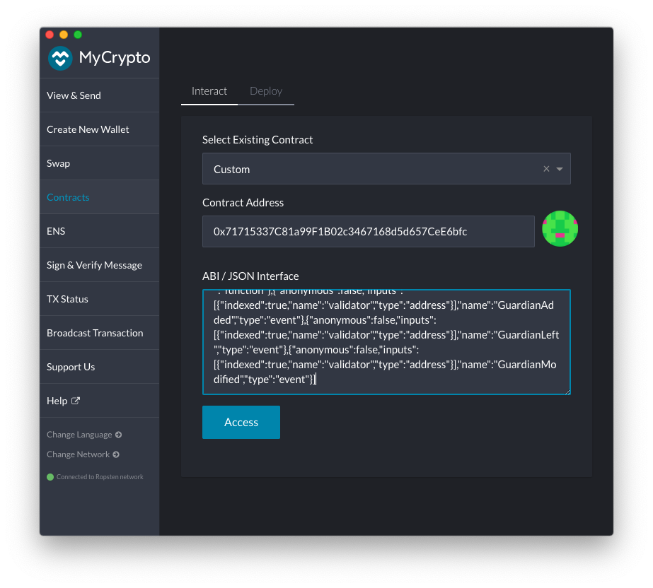
1. Click *Access*.
   * If the *Access* button appears disabled, make sure there are no trailing line feeds at the bottom of the *ABI / JSON Interface* text box.
1. Select `register` in the drop down list *Read / Write Contract*
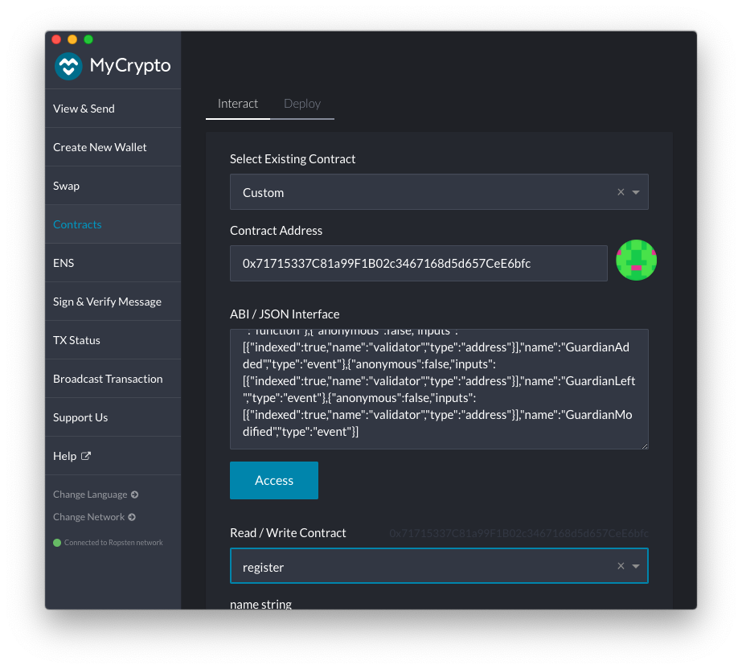
The function parameters for the `register` call will appear in the form.
1. Fill the fields labeled `name` and `website` 
with your guardian details.
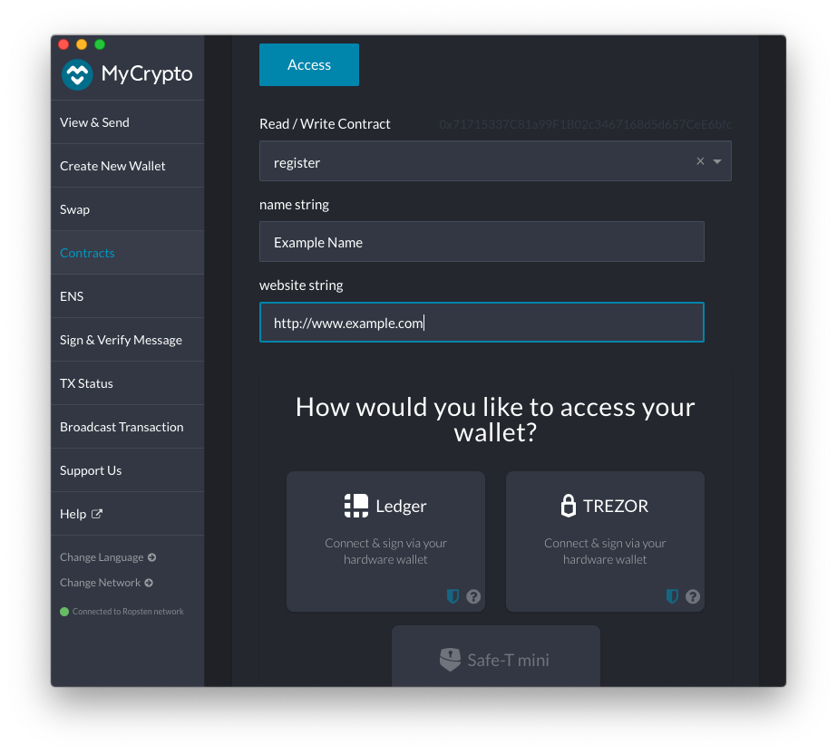
1. Choose one of the options under *How would you like to access your wallet?*
and provide your wallet information/credentials.
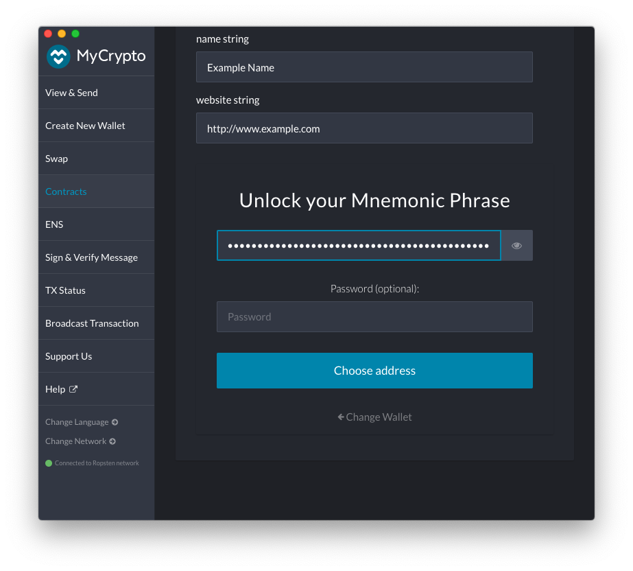
1. Proceed to *Select an Address*. Select your Guardians's Ethereum address. 
The address you choose will be the Guardians's identification for purpose
 of delegation later on.
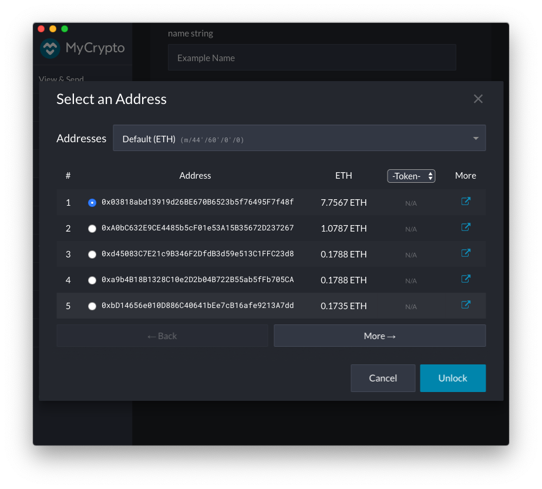
Click *Unlock*
1. After unlocking an account, a new field labeled *Value* will appear after the website entry field (see below).
Enter `1` in the *Value* field. This will send 1 Ether with your registration request as a deposit. `OrbsGuardian` contract
will refund you the deposit if you later request to unregister.
A 1 Ether deposit is required for registration. You may not send more than exactly 1 Ether.
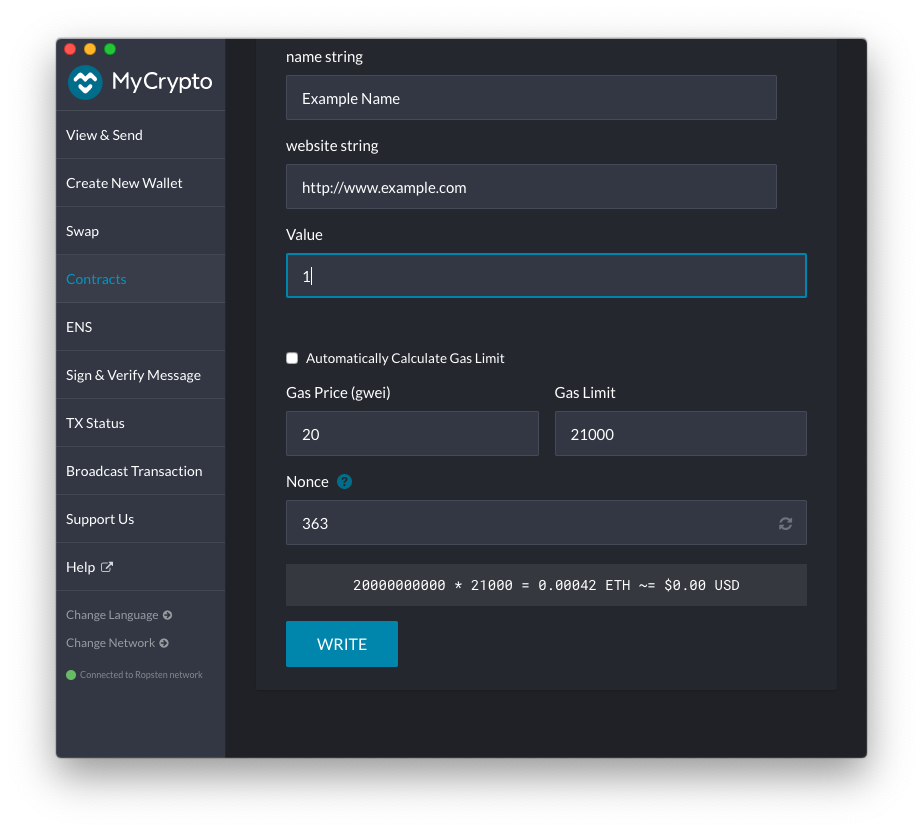
1. Verify that the option *Automatically Calculate Gas Limit* is switched off, and manually adjust the *Gas Limit* field as required. `500,000` will be more than enough (at the time this is being written a successful registration uses ~115000 Gas).

Click *Write* 
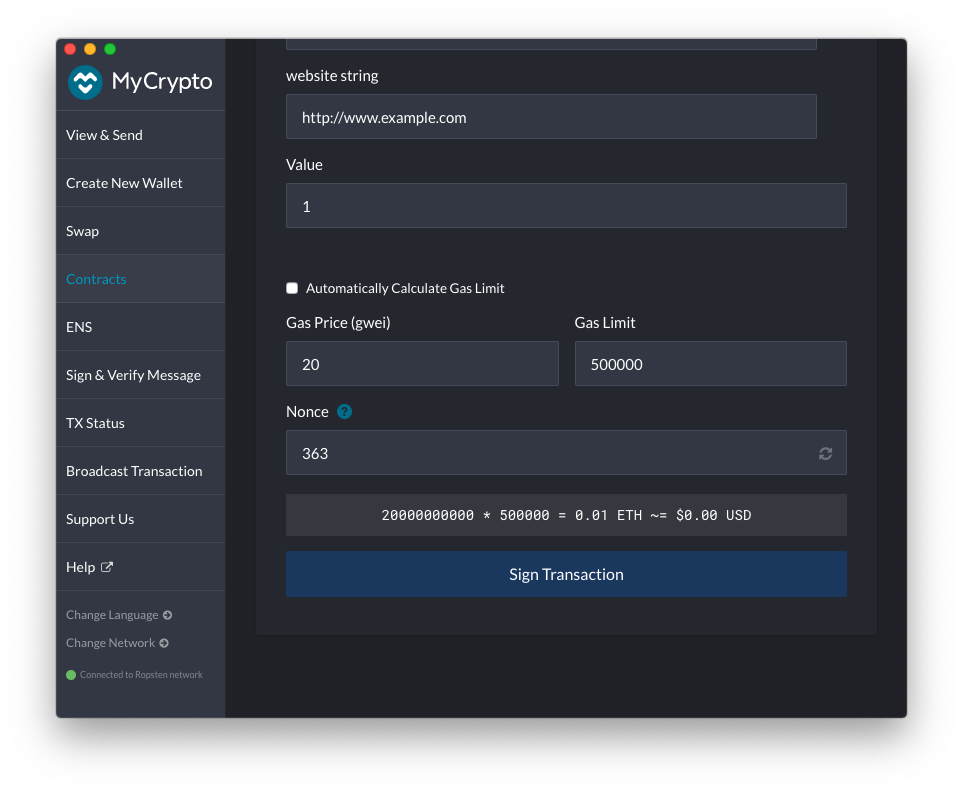
Click *Sign Transaction*
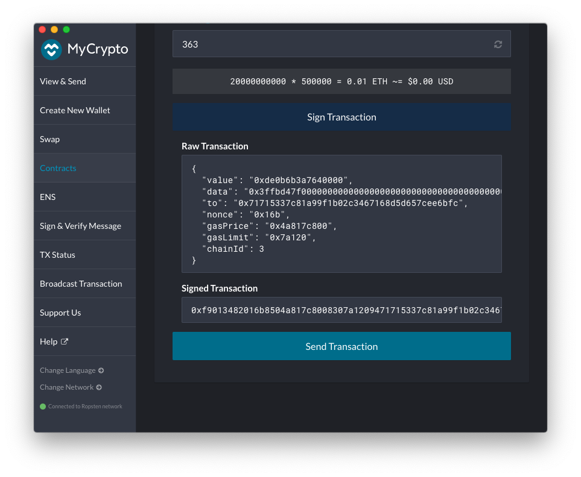
Click *Send Transaction*
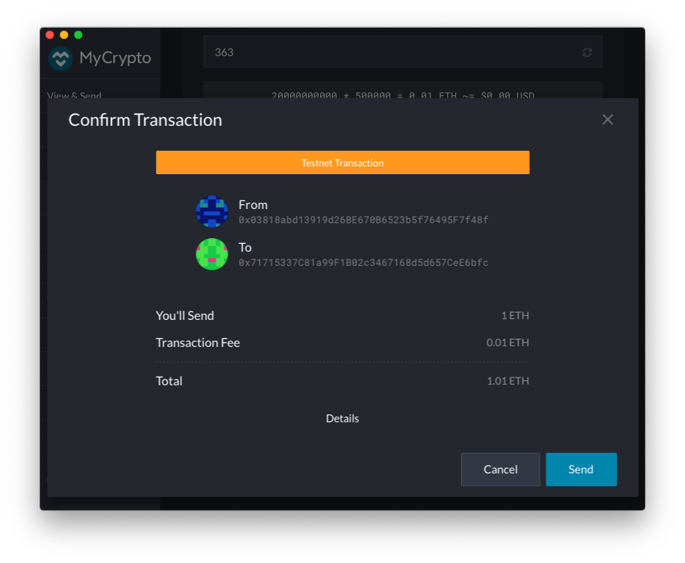
Review, then click *Send*
1. Once the transaction is sent, MyCrypto will provide a link to track the transaction status on Etherscan.
Navigate to *Etherscan* by clicking *Verify (Etherscan)*
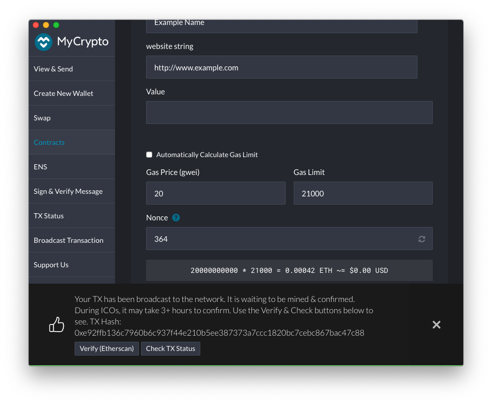

1. Confirm the transaction has been accepted successfully.

 
Make sure you see 
> TxReceipt Status:Success

With sufficient block confirmations.

[1]: https://ropsten.etherscan.io/address/0x71715337C81a99F1B02c3467168d5d657CeE6bfc#code

##### Notes
* The contract does not enforce uniqueness of name and website values between the different Guardians. Two Guardians may register with same name, or website url. It is up to the Delegators to vet their Guardians. 
* To make changes to your registration repeat the process providing new values. A deposit is not required when re-registering. If you send a second deposit the transaction will revert.
* To to be removed from the Guardians list, use the leave() function.
  * Upon leave() the 1 Ether deposit is transferred back to the Guardian address.
 

