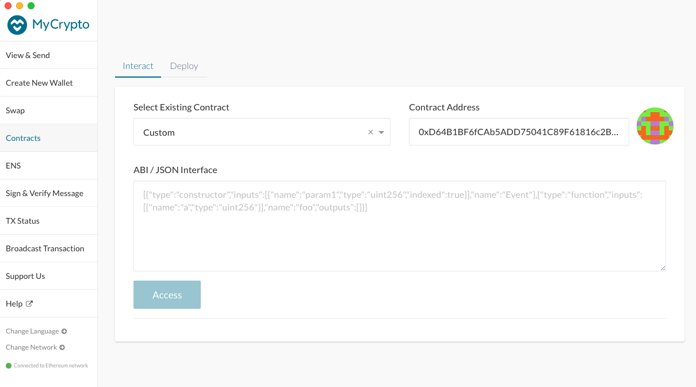
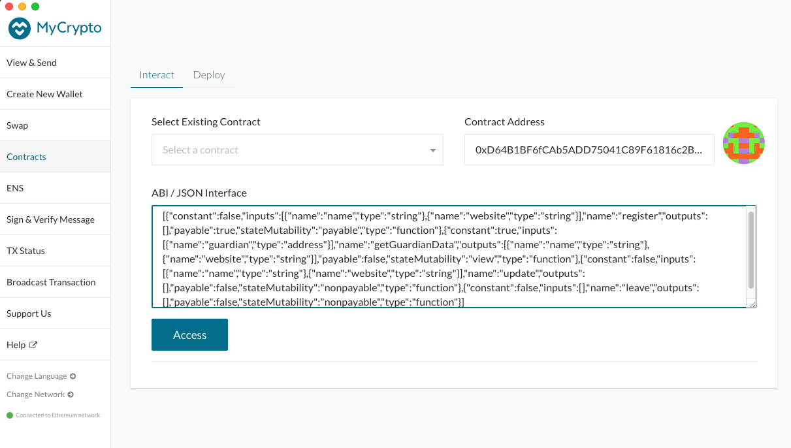
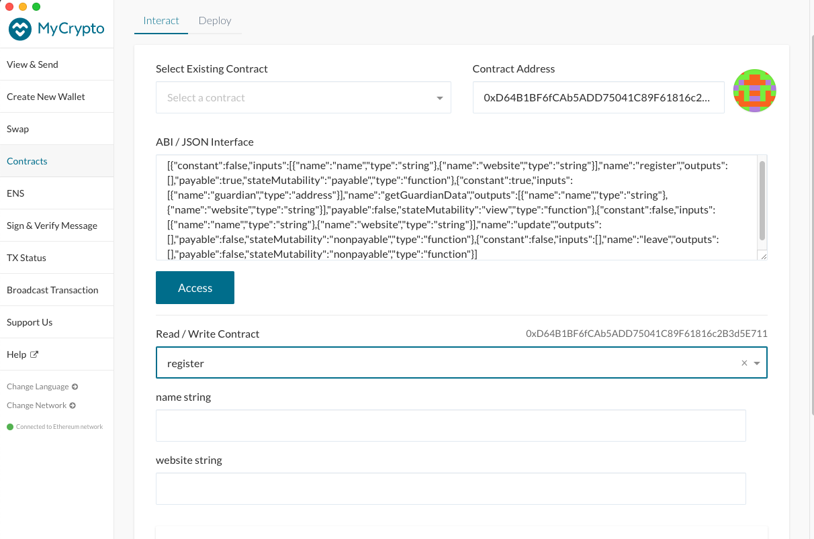
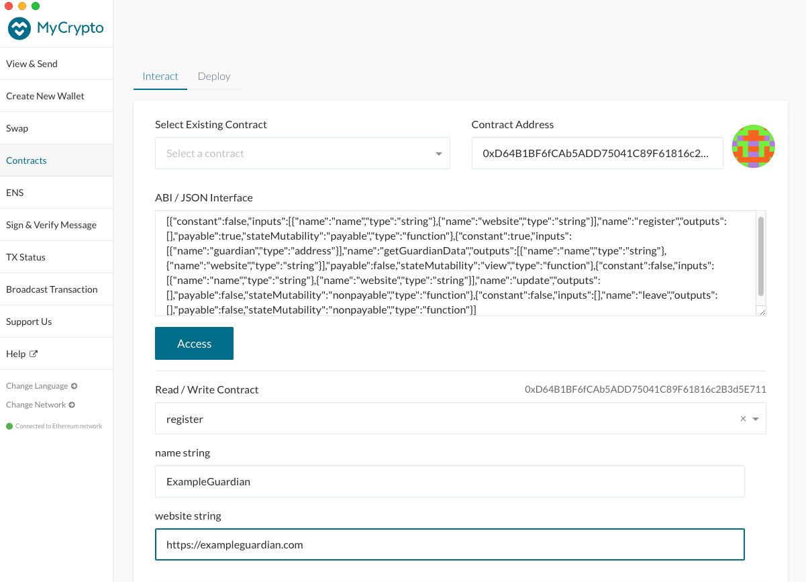
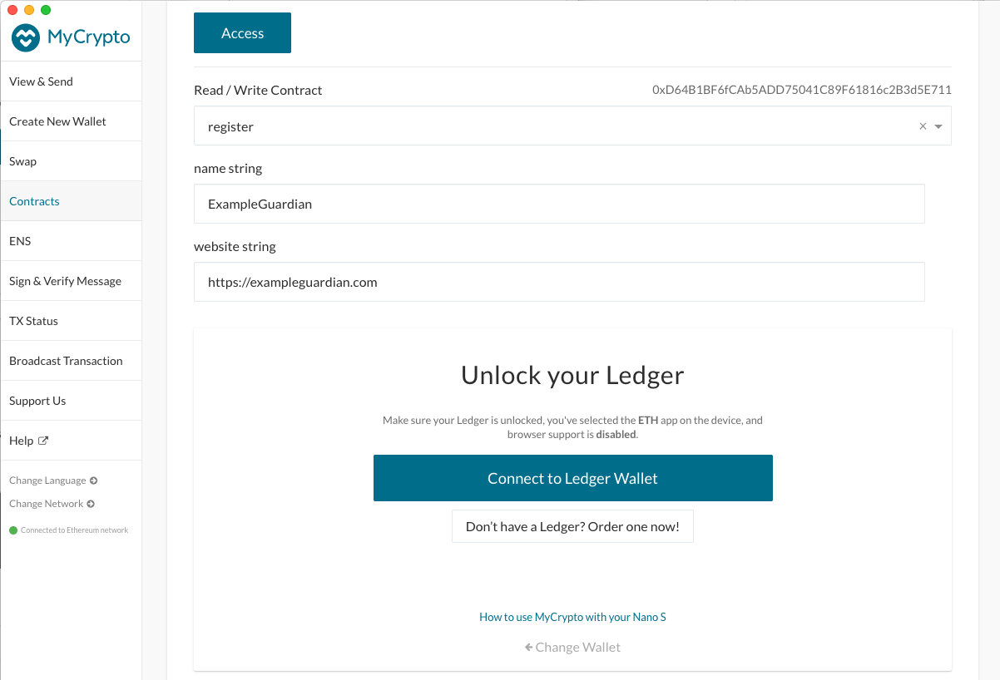
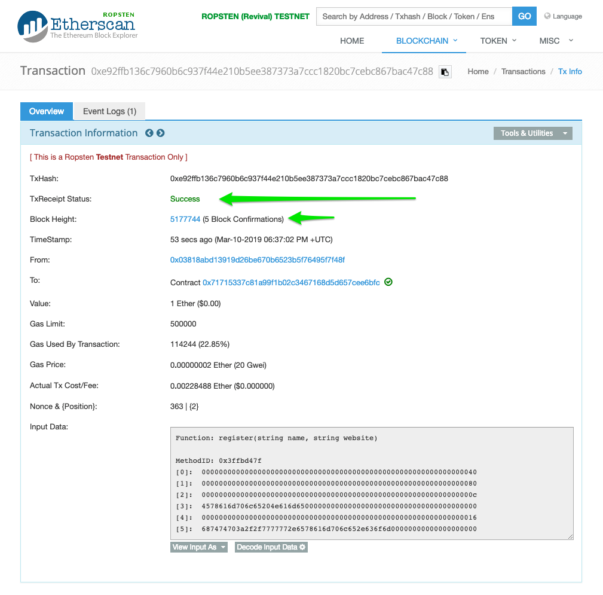

## Guardian Registration
In order to participate in voting, a Guardian must first register. 
An Orbs Guardian is identified by an Ethereum address. Delegation to a Guardian is done by delegating to the Guardian's Ethereum address. 

This document walks you through the Guardian registration process using the MyCrypto desktop wallet application.
Any wallet software may be used and the choice of MyCrypto here is for illustration only.

### A Guardian registration requires the following data:
- Guardian name and website URL

Note: A Guardian may update her registration data at any time or leave the registry.

### Registration pre-requirements
 - MyCrypto desktop app (or another equivalent wallet software)
 - A wallet configured with your Guardian's Ethereum account keys and a positive Ether balance to pay the Ethereum transaction fees (transaction and deposit)
 - 16 ETH deposit is required to register as a Guardian
 - Registration data (Guardian name + website URL)
 - ABI and contract address available below in the Registration steps or on [Etherscan][1] 

### Registration steps

1. **Verify you are on the correct network - Ethereum Mainnet** ([Choosing the relevant Ethereum Network](./choosing_the_network.md))
2. Navigate to *Contracts*, under the *Interact* tab.

3. Select an existing custom contact and enter the `OrbsGuardians` contract address. 

   **OrbsGuardians Contract Address**: `0xD64B1BF6fCAb5ADD75041C89F61816c2B3d5E711`
   
   The contract address and ABI are also available on [Etherscan][1].

   Paste the address in the **Contract Address** box.

4. Enter the `OrbsGuardians` contract ABI.
   
   **Registration Interface ABI:**

   [{"constant":false,"inputs":[{"name":"name","type":"string"},{"name":"website","type":"string"}],"name":"register","outputs":[],"payable":true,"stateMutability":"payable","type":"function"},{"constant":true,"inputs":[{"name":"guardian","type":"address"}],"name":"getGuardianData","outputs":[{"name":"name","type":"string"},{"name":"website","type":"string"}],"payable":false,"stateMutability":"view","type":"function"},{"constant":false,"inputs":[{"name":"name","type":"string"},{"name":"website","type":"string"}],"name":"update","outputs":[],"payable":false,"stateMutability":"nonpayable","type":"function"},{"constant":false,"inputs":[],"name":"leave","outputs":[],"payable":false,"stateMutability":"nonpayable","type":"function"}]

    Alternatively, the ABI may be extracted directly from [Etherscan][1], **Contract ABI** box.
  
    Paste the ABI in the **ABI / JSON Interface** box.

5. Click *Access*.
   * If the *Access* button appears disabled, make sure there are no trailing line feeds at the bottom of the *ABI / JSON Interface* text box.
6. Select `register` in the drop-down list *Read / Write Contract*

The function parameters for the `register` call will appear in the form.

7. Fill the fields labeled `name` and `website` with your Guardian details.

8. Choose one of the options under *How would you like to access your wallet?*
and provide your wallet information/credentials.
In this example we choose to work with a HW Ledger:

Proceed to *Choose Address*. 

9. Select your Guardians's Ethereum address. 
The address you choose will be the Guardians's identification for delegation and rewards calculation later on.

Click *Unlock*
10. After unlocking an account, a new field labeled *Value* will appear after the website entry field (see below).
Enter `16` in the *Value* field. This will send 16 Ether with your registration request as a deposit. `OrbsGuardian` contract will refund you the deposit if you later request to leave. 
Note: there is a 2-weeks minimal participation period and only after this period a Guardian can leave and receive her deposit back.
Exactly 16 Ether deposit is required for registration. You may not send more than exactly 16 Ether.

11. Uncheck *Automatically Calculate Gas Limit* and adjust the *Gas Limit* as required. 
`500,000` should be more than enough (at the time this is being written a successful registration uses 
~115000 gas). You will not be charged for unused gas. Please update the Gas Price to a reasonable value, for example according to https://ethgasstation.info/

Click *Write* 

Click *Sign Transaction*

Click *Send Transaction*

Review, then click *Send*

12. Once the transaction is sent, MyCrypto will provide a link to track the transaction status on Etherscan.
Navigate to *Etherscan* by clicking *Verify (Etherscan)*

13. Confirm the transaction has been accepted successfully.

 
Make sure you see 
> TxReceipt Status:Success

With sufficient block confirmations.

14. Review your registration data by calling getGuardianData() with your Ethereum address.

[1]: https://etherscan.io/address/0xd64b1bf6fcab5add75041c89f61816c2b3d5e711#code

##### Notes
* Only an externally owned account may register as a Guardian.
* The contract does not enforce uniqueness of name and website values between the different Guardians. Two Guardians may register with same name, or website url. It is up to the Delegators to vet their Guardians. 
* To make changes to your registration, repeat using the update() function instead of register(). There is no need for an additional deposit upon update(). 
* To to be removed from the Guardians list, use the leave() function.
  - Upon leave() the 16 ETH deposit is transferred back to the Guardian address.
  - Note: there is a 2-weeks minimal participation period and only after this period a Guardian can leave and receive her deposit back.
 

