## Validator Registration

Validator candidates may register to be elected as a Validator using OrbsValidatorsRegistry Ethereum Contract.  
An Orbs Validator is identified and voted for by her Ethereum address. 

This document walks you through the Validator registration process using the MyCrypto desktop wallet application.
Any wallet software may be used and the choice of MyCrypto here is for illustration only.

### A Validator registration requires the following data:
- Validator name and website URL
- IP Address of the Orbs node
- An Orbs node public address
  - The Orbs node addressing scheme is similar to Ethereum.

Note: A Validator may update her registration data at any time or leave the registry.

&nbsp;
### Registration pre-requirements
 - MyCrypto desktop app (or another similar wallet software)
 - A wallet configured with your Validator's Ethereum account keys and a positive Ether balance for Ethereum transaction gas payment
 - Registration data (see above)
 - ABI and contract address, available below in the **Registration** steps or on [Etherscan][2]

&nbsp;
### Registration steps

In order to register a Validator with OrbsValidatorsRegistry contract follow these steps:

1. **Verify you are on the correct network** (See [Choosing the relevant Ethereum Network])(./choosing_the_network.md))
   
1. Navigate to *Contracts*, under the *Interact* tab.
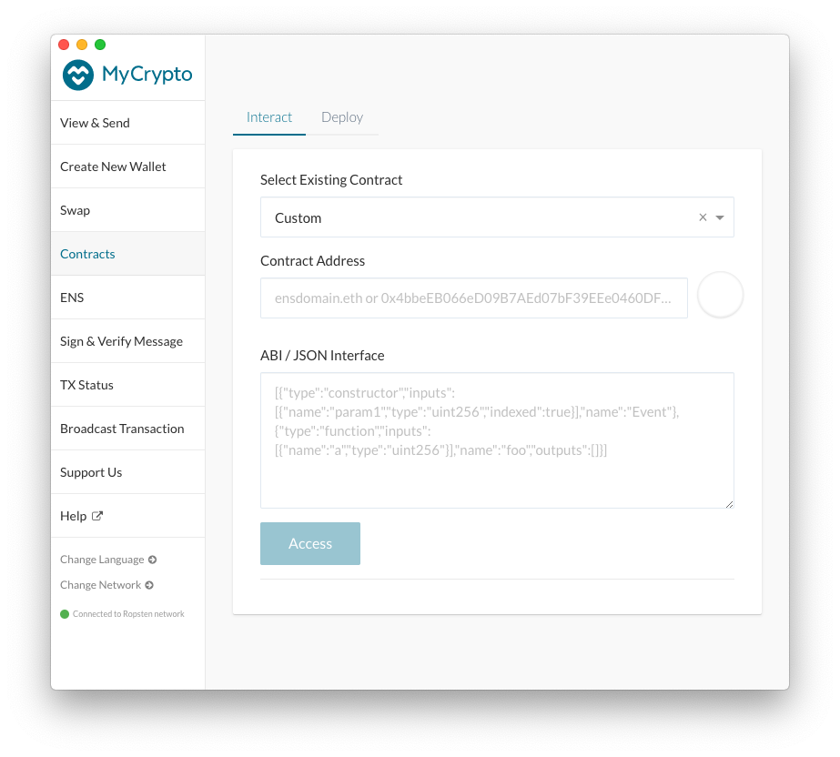

1. Select an existing custom contact amd enter the `OrbsValidatorsRegistry` contract address. 
   
    **OrbsValidatorsRegistry Contract Address**: `0xF5Ae25B2A6346cE532E8B0A0Ce14C1BAdf96D6E7`
  
    The contract address and ABI are also available on [Etherscan][2].

    Paste the address in the **Contract Address** box.

    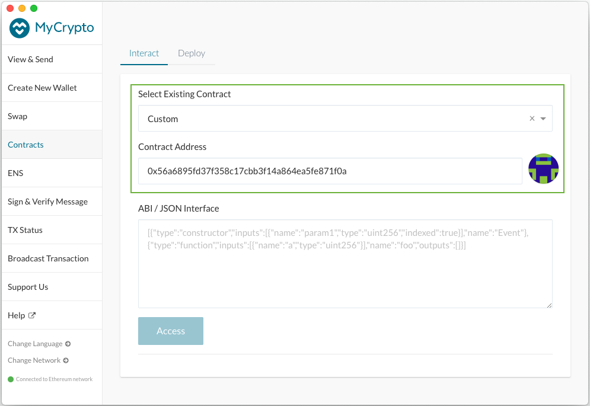

1. Enter the `OrbsValidatorsRegistry` contract ABI.
   
   **Registration Interface ABI:**

   [{"constant":false,"inputs":[{"name":"name","type":"string"},{"name":"ipAddress","type":"bytes4"},{"name":"website","type":"string"},{"name":"orbsAddress","type":"bytes20"}],"name":"update","outputs":[],"payable":false,"stateMutability":"nonpayable","type":"function"},{"constant":false,"inputs":[{"name":"name","type":"string"},{"name":"ipAddress","type":"bytes4"},{"name":"website","type":"string"},{"name":"orbsAddress","type":"bytes20"}],"name":"register","outputs":[],"payable":false,"stateMutability":"nonpayable","type":"function"},{"constant":false,"inputs":[],"name":"leave","outputs":[],"payable":false,"stateMutability":"nonpayable","type":"function"},{"constant":true,"inputs":[],"name":"reviewRegistration","outputs":[{"name":"name","type":"string"},{"name":"ipAddress","type":"bytes4"},{"name":"website","type":"string"},{"name":"orbsAddress","type":"bytes20"}],"payable":false,"stateMutability":"view","type":"function"}]

    Alternatively, the ABI may be extracted directly from [Etherscan][2], **Contract ABI** box.
  
    Paste the ABI in the **ABI / JSON Interface** box.

    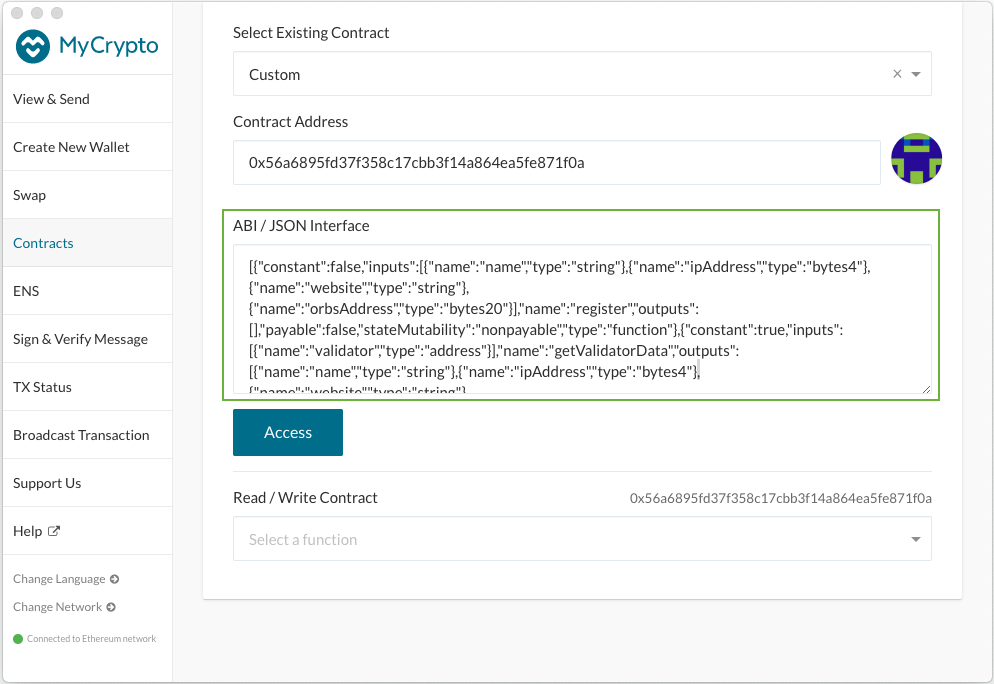

1. Click *Access*.
* If the *Access* button appears disabled, make sure there are no trailing line feeds at the bottom of the *ABI / JSON Interface* text box.

1. Select `register` in the drop down list *Read / Write Contract*
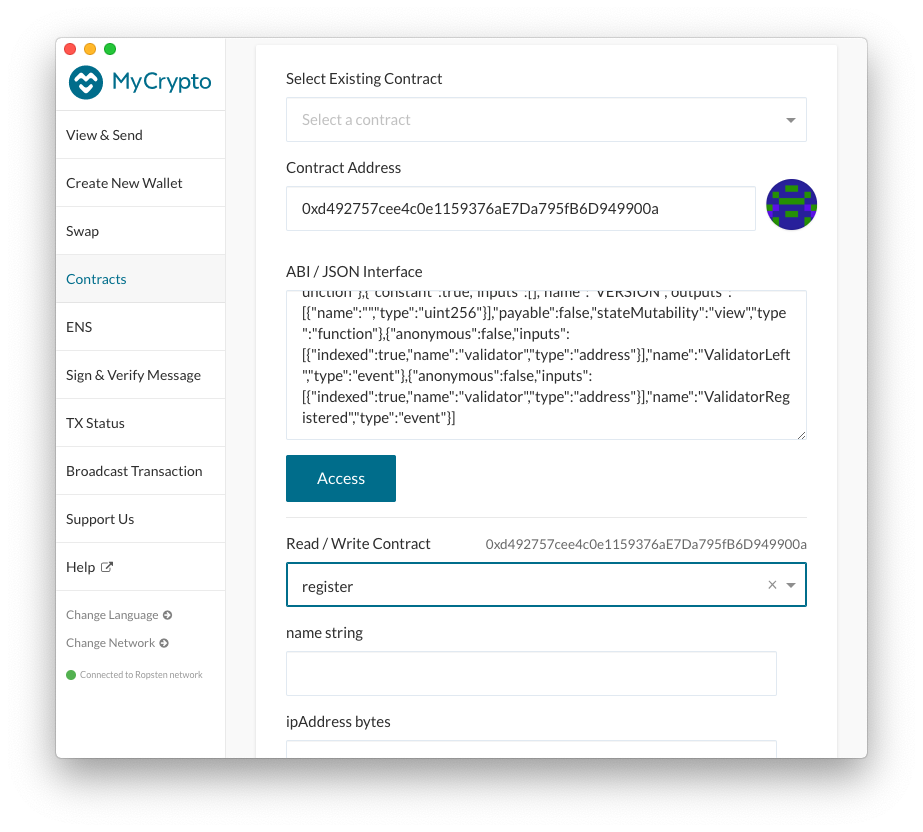
The function parameters for the `register` call will appear in the form.

1. Fill the fields labeled `name`, `ipAddress`, `website`, `OrbsAddress` 
with your Validator's registration data.
    - OrbsAddress must be formatted as a valid Ethereum address type.
    - IP address must first be converted to a hexadecimal number representation:
        - The hexadecimal number representation begins with `0x` followed by 8 hexadecimal digits, two for each byte in the IP address. for example: `216.58.207.46` will be formatted `0xd83acf2e`.
        - Several online tools can perform the conversion. [Here is one example with screen shots](https://www.browserling.com/tools/ip-to-hex):

        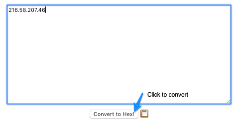
 
        Paste your Orbs node's IP address in the text box and click *Convert to Hex!* 

        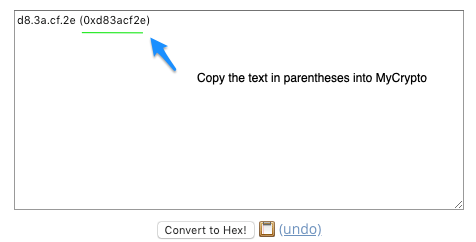
        
        Copy the hexadecimal number representation contained within the parentheses. Don't forget to include the prefix `0x`       
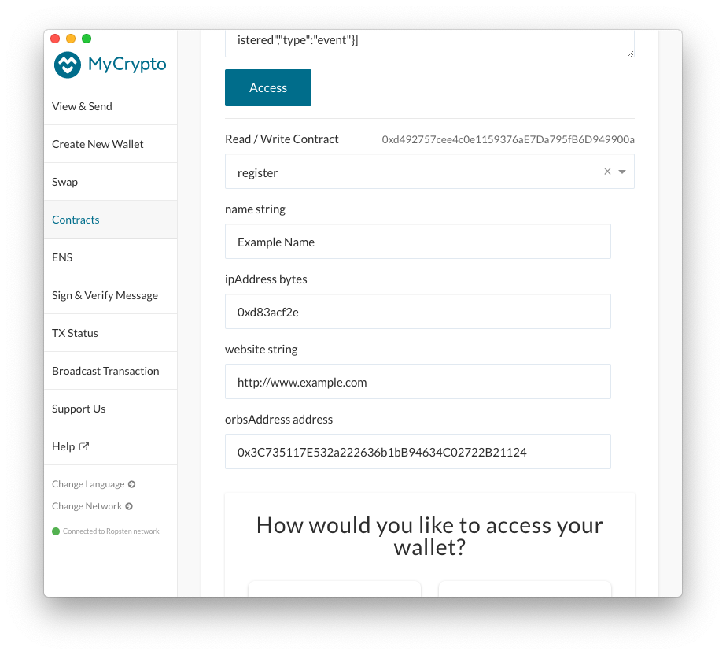

1. Choose one of the options under *How would you like to access your wallet?*
and provide your wallet information/credentials.
In this example we choose to provide a mnemonic to open our wallet:
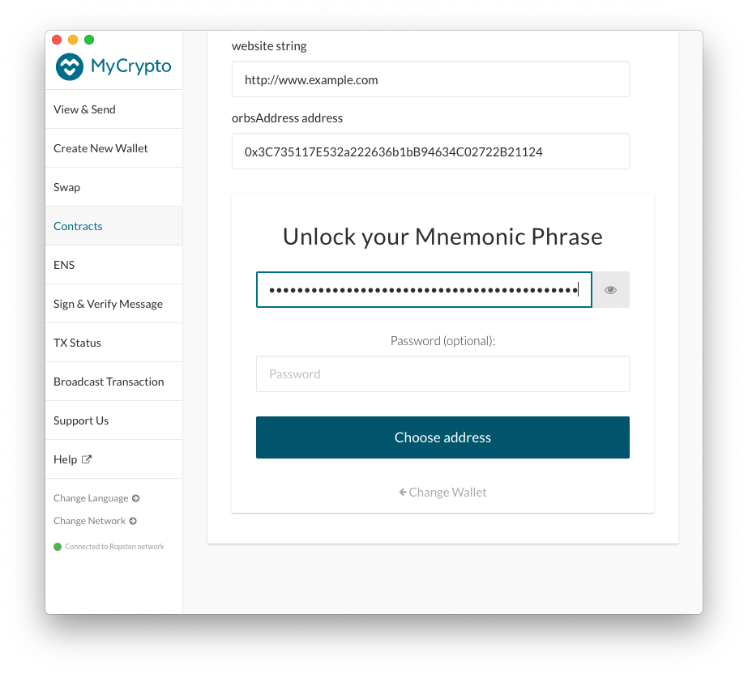
Proceed to *Choose Address*. 

1. Select your Validator's Ethereum address. 
The address you choose will be the Validator's identification for voting later on.
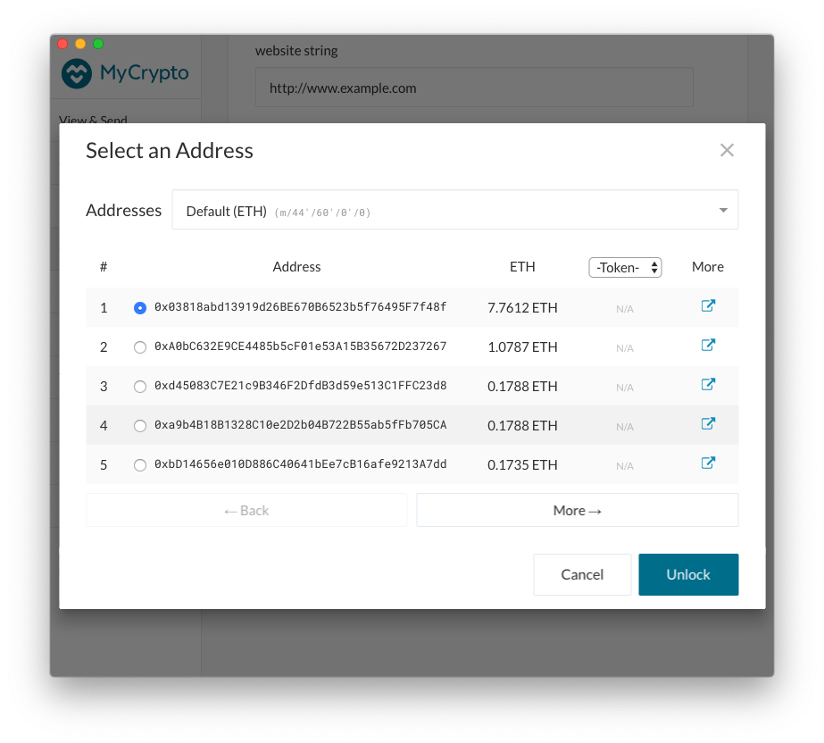
Make sure the account has a positive Ether balance for transaction fees. Then click *Unlock*.

1. Uncheck *Automatically Calculate Gas Limit* and adjust the *Gas Limit* as required. 
`500,000` should be more than enough (at the time this is being written a successful registration uses 
~174000 gas). You will not be charged for unused gas.
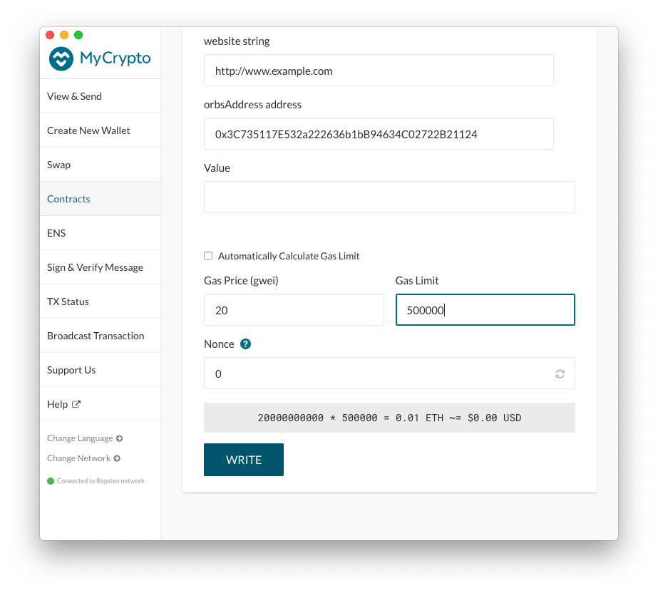
Click *Write*, then *Sign Transaction* 
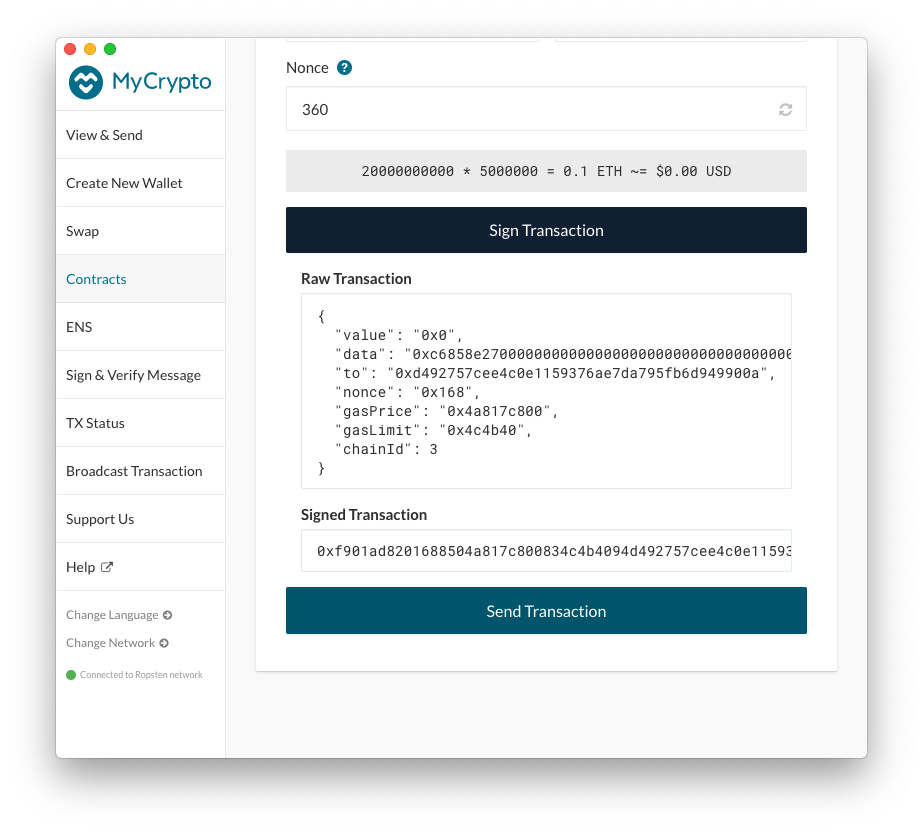
Click *Send Transaction*

Review, then click *Send*

1. Once the transaction is sent, MyCrypto will provide a link to track the transaction status on Etherscan.
Navigate to *Etherscan* by clicking *Verify (Etherscan)*
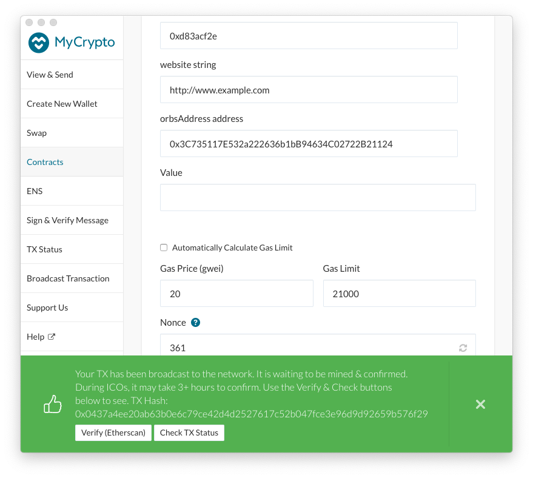

1. Confirm the transaction has been accepted successfully.
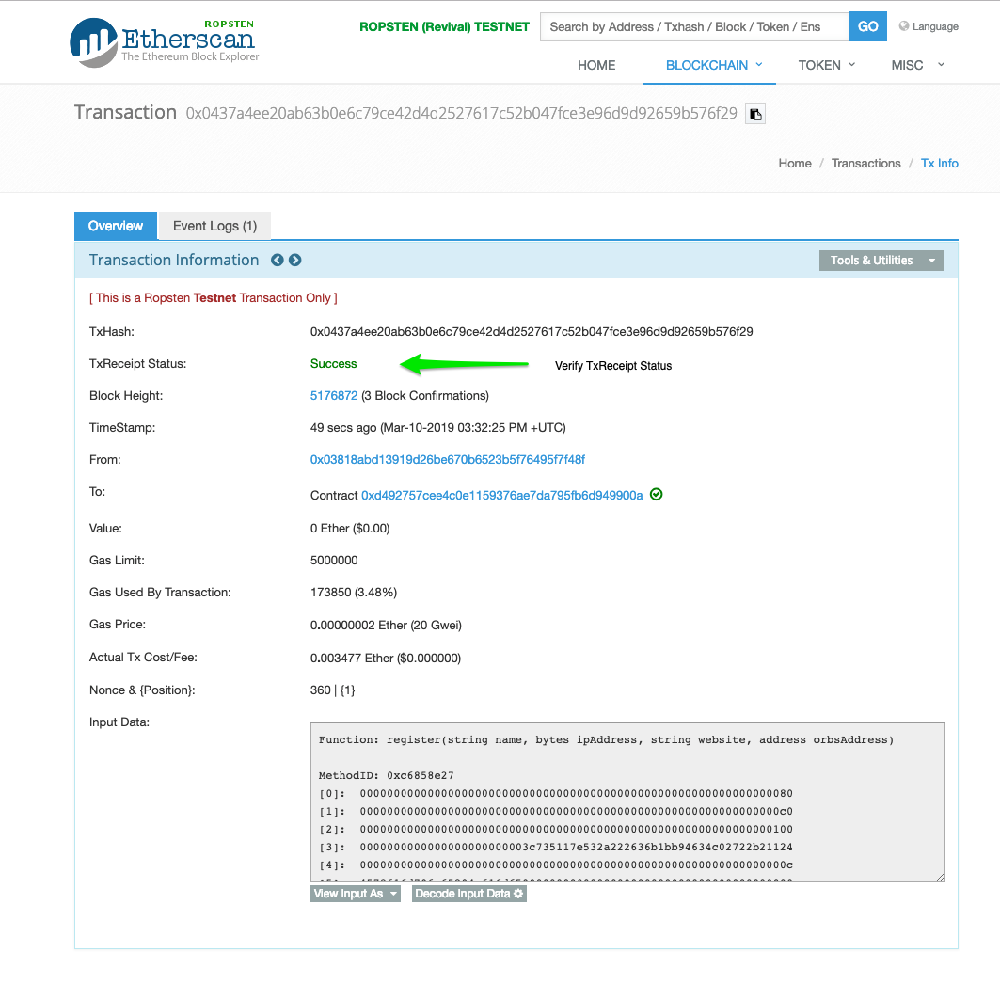
 
Make sure you see 
> TxReceipt Status:Success

With sufficient block confirmations.

[2]: https://etherscan.io/address/0xF5Ae25B2A6346cE532E8B0A0Ce14C1BAdf96D6E7#code
[3]: 0xF5Ae25B2A6346cE532E8B0A0Ce14C1BAdf96D6E7

##### Notes
* The IP Address and Orbs public address must be unique among the different Validators. An attempt to register a Validator with an IP address or Orbs address identical to another registered Validator, will fail the registration.
* To make changes to your registration repeat using the update() function instead of register().
* To to be removed from the Validators Registry, use the leave() function.
